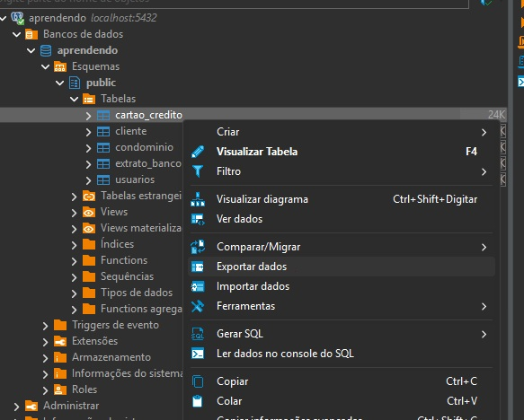
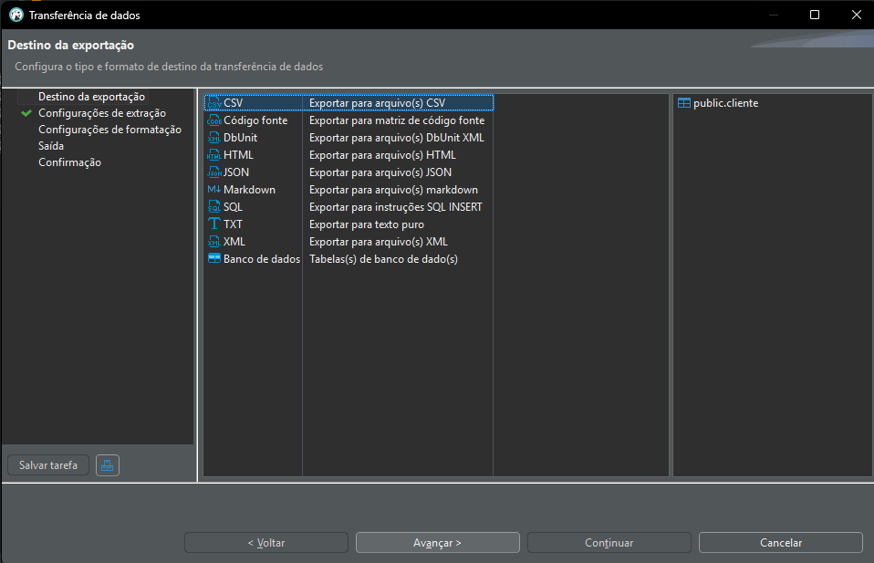
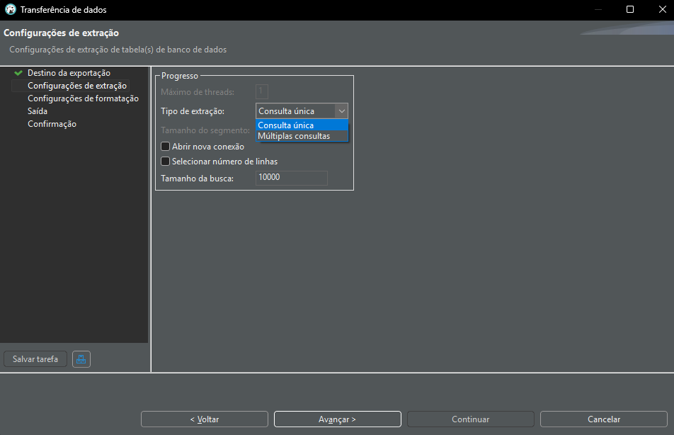
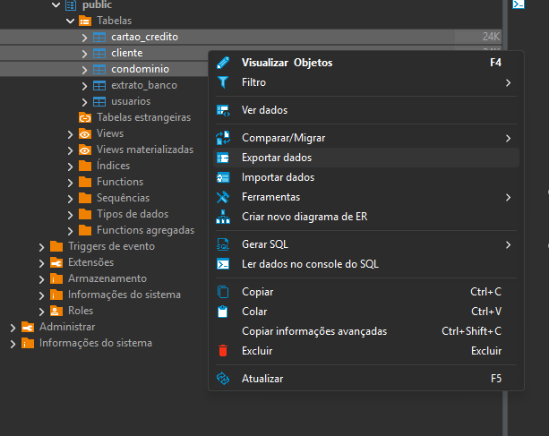
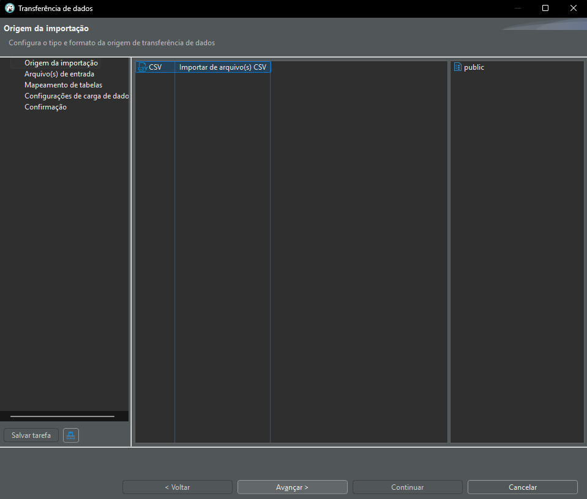
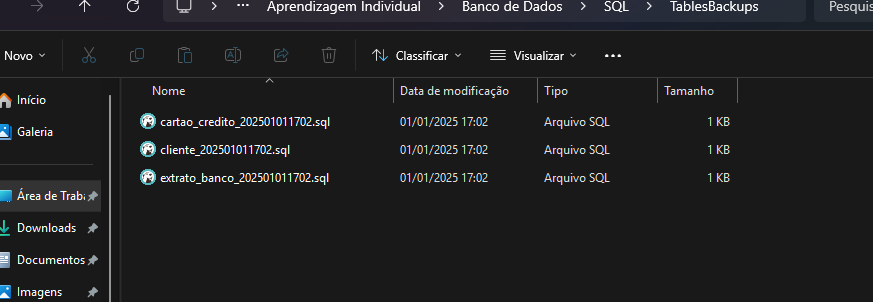

# Sumário

- [Tutorial Parte I - Entendendo as Nomenclaturas Iniciais](#tutorial-parte-i---entendendo-as-nomenclaturas-iniciais)
- [Tutorial Parte II - Tipos de Dados](#tutorial-parte-ii---tipos-de-dados)
- [Tutorial Parte III - Comandos, Criação e Relacionamento de Tabelas](#tutorial-parte-iii---comandos-criaçao-e-relacionamento-de-tabelas)
- [Tutorial Parte IV - Funções básicas de Agregação, Trigger e Consultas](#tutorial-parte-iv---funções-básicas-de-agregação-trigger-e-consultas)
- [Tutorial Parte V - Como realizar backup, exportação e importação](#tutorial-parte-v---como-realizar-backup-exportação-e-importação)
- [Tutorial Parte VI - Subqueries e CTEs](#tutorial-parte-vi---subqueries-e-ctes)
- [Tutorial Parte VII - Índices, Tipos de Dados Avançados e Views](#tutorial-parte-vii-índices-tipos-de-dados-avançados-e-views)
- [Tutorial Parte VIII - Funções e Procedimentos](#tutorial-parte-viii---funções-e-procedimentos)
- [Tutorial Parte IX - Controle e Segurança](#tutorial-parte-ix---controle-e-segurança)
- [Tutorial Parte X - Otimização de Consultas](#tutorial-parte-x---otimização-de-consultas)
- [Tutorial Parte XI - Trabalhando com Tipos de Dados Avançados](#tutorial-parte-xi---trabalhando-com-tipos-de-dados-avançados)
- [Tutorial Parte XII - Integração e Automação](#tutorial-parte-xii---integração-e-automação)
- [Tutorial Parte XIII - Projetos e Estudos de Caso](#tutorial-parte-xiii---projetos-e-estudos-de-caso)

# Tutorial Parte I - Entendendo as Nomenclaturas Iniciais

Neste tutorial, vamos entender as nomenclaturas e conceitos básicos relacionados a banco de dados, postgreSQL e operações comuns em um banco relacional.

## O que é uma **query**?

Uma **query** é uma requisição feita ao banco de dados, geralmente utilizando a linguagem SQL (Structured Query Language). Ela serve para interagir com o banco de dados, seja para buscar dados, modificar informações, inserir ou deletar registros.

### Tipos de Queries Comuns:
- **SELECT**: Utilizado para consultar ou buscar dados de uma tabela.
- **INSERT**: Usado para adicionar novos registros em uma tabela.
- **UPDATE**: Para modificar dados já existentes em uma tabela.
- **DELETE**: Para remover dados de uma tabela.

## O que é uma **tabela**?

Uma **tabela** é uma estrutura de dados que organiza informações em linhas (também chamadas de registros ou "tuplas") e colunas (chamadas de campos ou atributos). Cada coluna tem um nome e um tipo de dado específico, e cada linha contém um conjunto de dados relacionados.

## O que é uma **coluna**?

Uma **coluna** é um campo de uma tabela, onde os dados são armazenados. Cada coluna tem um nome e um tipo de dado (como `VARCHAR`, `INT`, `DATE`, entre outros) que define o tipo de informações que ela pode armazenar. Por exemplo, uma tabela de usuários pode ter colunas como `id`, `nome`, `email`.

## O que é um **registro**?

Um **registro** (ou **linha**) é um conjunto de dados correspondentes aos campos de uma tabela. Cada linha contém valores para cada coluna. Por exemplo, em uma tabela de usuários, um registro pode conter o nome, e-mail e ID de um usuário específico.

## O que é uma **chave primária (PRIMARY KEY)**?

A **chave primária** é uma coluna (ou conjunto de colunas) que identifica de forma única cada registro em uma tabela. Nenhum valor na chave primária pode ser nulo e deve ser único em cada linha da tabela.

## O que é uma **chave estrangeira (FOREIGN KEY)**?

Uma **chave estrangeira** é uma coluna em uma tabela que faz referência à chave primária de outra tabela. Ela é usada para estabelecer relacionamentos entre duas tabelas, permitindo que as informações sejam associadas de maneira eficiente.

Exemplo:
- Em uma tabela de **usuários**, a chave estrangeira pode ser `condominio_id`, que faz referência à tabela `condominio` e liga um usuário a um condomínio específico. (Presente no exemplo 1 dos scripts)

# Tutorial Parte II - Tipos de Dados

## Tipos de Dados em SQL

Ao criar tabelas em SQL, cada coluna precisa ter um tipo de dado definido. O tipo de dado determina o tipo de valores que aquela coluna pode armazenar, como texto, números ou datas.

## Principais Tipos de Dados

### 1. **Tipos Numéricos**
Usados para armazenar números inteiros ou decimais.

- **`INT`**: Armazena números inteiros. Exemplo: 1, 42, -100.  
  - **`SMALLINT`**: Para números inteiros menores (economiza espaço). Exemplo: 1, 255.
  - **`BIGINT`**: Para números inteiros grandes. Exemplo: 9.223.372.036.854.775.807.
- **`DECIMAL(p, s)` ou `NUMERIC(p, s)`**: Armazena números decimais com precisão definida.  
  - `p`: Total de dígitos.  
  - `s`: Quantidade de dígitos após o ponto decimal.  
  - Exemplo: `DECIMAL(10, 2)` armazena até 10 dígitos, sendo 2 após o ponto decimal (como `12345678.90`).
- **`FLOAT`** ou **`REAL`**: Para números com ponto flutuante (menos precisos que `DECIMAL`).

### 2. **Tipos de Texto**
Usados para armazenar strings (textos).

- **`CHAR(n)`**: Armazena strings de tamanho fixo. Exemplo: `CHAR(5)` sempre reserva 5 caracteres, mesmo que o valor seja menor.
- **`VARCHAR(n)`**: Armazena strings de tamanho variável até o limite especificado. Exemplo: `VARCHAR(100)` permite strings de até 100 caracteres.
- **`TEXT`**: Para armazenar textos longos sem limite especificado. Exemplo: Artigos ou descrições detalhadas.

### 3. **Tipos de Data e Hora**
Usados para armazenar informações temporais.

- **`DATE`**: Apenas a data (ano, mês, dia). Exemplo: `2024-12-30`.
- **`TIME`**: Apenas a hora (hora, minutos, segundos). Exemplo: `14:30:00`.
- **`TIMESTAMP`**: Combina data e hora. Exemplo: `2024-12-30 14:30:00`.
- **`INTERVAL`**: Armazena períodos de tempo (como "2 dias" ou "3 horas").

### 4. **Tipos Booleanos**
Armazena valores lógicos.

- **`BOOLEAN`**: Representa `TRUE`, `FALSE` ou `NULL`.

### 5. **Tipos Especiais**
Usados para casos mais específicos.

- **`SERIAL`**: Usado para criar identificadores únicos automaticamente. Geralmente usado para chaves primárias. Exemplo: `id SERIAL`.
- **`JSON`** ou **`JSONB`**: Para armazenar dados no formato JSON (útil em bancos modernos).
- **`ARRAY`**: Permite armazenar múltiplos valores em uma única coluna.

## Escolhendo o Tipo Certo

Escolher o tipo de dado correto é essencial para garantir que:
1. **Os valores armazenados estejam no formato correto.**
2. **O espaço de armazenamento seja utilizado de forma eficiente.**

Por exemplo:
- Para **idade**, use `SMALLINT` em vez de `INT`, pois o valor máximo será pequeno.
- Para **nomes**, use `VARCHAR(100)` ou `TEXT` dependendo da necessidade.
- Para valores monetários, `DECIMAL(10, 2)` é uma escolha ideal.

---

Com esses tipos de dados, você pode modelar tabelas de forma eficiente, garantindo consistência e desempenho no banco de dados.

# Tutorial Parte III - Comandos, Criação e Relacionamento de Tabelas

### Categorias de Comandos:

#### DDL (Data Definition Language)

Comandos DDL são usados para definir e modificar a estrutura do banco de dados. Eles alteram o esquema do banco de dados e geralmente afetam a forma como os dados são armazenados. Alguns comandos DDL incluem:

CREATE: Cria um novo banco de dados, tabela, índice, ou outra estrutura de dados.
ALTER: Modifica a estrutura de uma tabela existente, como adicionar, alterar ou excluir colunas.
DROP: Exclui um banco de dados, tabela ou outro objeto do banco de dados.
TRUNCATE: Remove todos os dados de uma tabela, mas mantém a estrutura da tabela.
RENAME: Altera o nome de um objeto no banco de dados.

DML (Data Manipulation Language)

Comandos DML são usados para manipular os dados dentro das tabelas de um banco de dados. Eles não alteram a estrutura do banco de dados, mas permitem que você faça operações com os dados armazenados. Alguns comandos DML incluem:

SELECT: Recupera dados de uma ou mais tabelas.
INSERT: Adiciona novos dados em uma tabela.
UPDATE: Modifica dados existentes em uma tabela.
DELETE: Remove dados de uma tabela.

```sql

-- criando  tabela novamente para reforçar

create table usuarios (
	id serial primary key,
	nome VARCHAR(100),
	email VARCHAR(100)
);

-- inserindo valores

insert into usuarios (nome, email)
values
('Igor Pereira', 'igor@gmail.com'),
('Mariana', 'mari@gmail.com');

--checando se está tudo certo

select * from usuarios;

--criando a tabela condominio para que eu possa relacionar

create table condominio (
	id serial primary key,
	nome VARCHAR(100),
	apartamento smallint,
	bloco smallint,
	alguel decimal(10,2)
);

--percebi o erro na escrita, mas agora aprendi a renomear

alter table condominio
rename alguel to aluguel;

--inseri valores dentro da tabela condominio

insert into condominio(nome, apartamento, bloco, aluguel)
values
('Igor Pereira', 12, 3, 1200.00),
('João Celestino', 15, 4, 1000.00);

--checando os dados

select * from condominio;

--agora eu estou fazendo a relação entre as tabelas, para começo
--adicionei uma nova coluna na tabela usuarios

alter table usuarios
add column condominio_id INT;

--em seguida estou definindo que essa coluna é uma chave estrangeira

alter table usuarios
add constraint condominio_id -- Cria chave estrangeira para relacionar a tabela usuarios com a tabela condominio
foreign key (condominio_id) references condominio(id) -- E essa é a coluna que vai referenciar as duas tabelas
on delete set null; -- se condominio for deletado o campo será null

--Vamos atualizar agora essas tabelas!

update usuarios u
set condominio_id = c.id
from condominio c
where u.condominio_id IS NULL
and c.nome = u.nome;

--Mas perceba que na linha 2 Mariana, a associação não está funcionando porque la em cima eu adicionei outro nome

select u.id as usuario_id, u.nome as usuario_nome, u.email as usuario_email, u.condominio_id, c.nome as condominio_nome
from usuarios u
left join condominio c on u.condominio_id = c.id;

--Ajustes

update condominio
set nome = 'Mariana'
where id = 6;
-- Como eu deletei algumas vezes, o id de condominio continuou subindo,
-- logo quando voltei a essa correção tive que mudar o número do id
--mas caso você esteja fazendo isso pela primeira vez então: where id = 2;

--Novamente

update usuarios u
set condominio_id = c.id
from condominio c
where u.condominio_id is null
and c.nome = u.nome;

-- Nesse select fiz alguns nomes temporarios para melhorar o entendimento
select u.id as usuario_id, u.nome as usuario_nome, u.email as usuario_email, u.condominio_id, c.nome as condominio_nome
from usuarios u
left join condominio c on u.condominio_id = c.id;

-- Apenas o usuarios que possuem um condominio_id dentro da tabela de usuarios
-- compatível com um condominio_id dentro da tabela condominio serão mostrados
select usuarios.nome, condominio.nome
from usuarios
inner join condominio on usuarios.condominio_id = condominio.id;

-- Serão mostrados todos os nomes da tabela da esquerda, mas a da direita os
-- que não estiverem de acordo com a condição será apresentado como NULL

select usuarios.nome, condominio.nome
from usuarios
left join condominio on usuarios.condominio_id = condominio.id;

-- Serão mostradas condominio.nome da tabela da direita, mas o que
-- não estiver associado na esquerda será demonstrado como NULL

select usuarios.nome, condominio.nome
from usuarios
right join condominio on usuarios.condominio_id = condominio.id;

--Todas as linhas serão mostradas independente da correspondencia

select usuarios.nome, condominio.nome
from usuarios
full join condominio on usuarios.condominio_id = condominio.id;

--Todos os usuarios serão combinados com todos os nomes de condominios
-- formando a todas as combinações possíveis, resumindo: é um produto cartesiano.

select usuarios.nome, condominio.nome
from usuarios
cross join condominio;

--Vamos adicionar alguns usuarios desconexos com condominios e virce-versa para entender melhor o JOIN

insert into condominio (nome,apartamento,bloco,aluguel)
values
('Lucas', 27, 6, 800.00);

insert into usuarios (nome,email)
values
('Natan', 'natanzinhogameplays@gmail.com');

--Conferindo

select * from usuarios;

select * from condominio;

-- Agora repita todos os comandos anteriores de Inner, Left, Right, Full e Cross. Agora você vai entender a diferença!
```
# Tutorial Parte IV - Funções básicas de Agregação, Trigger e Consultas

```sql
-- Vamos criar um novo contexto com novas tabelas para aprender sobre funções básicas de agregação (count,sum,avg,max,min)

create table cliente (
	id serial primary key,
	nome VARCHAR(100) not null, --not null significa que essa coluna não pode conter valores nulos
	cpf VARCHAR(11) not null,
	email VARCHAR(255) not null
);

insert into cliente ( nome, cpf, email)
values
('Igor Pereira', '53004758075', 'shaolinmatadordeporco@hotwells.com'),
('Ivanilson', '72348676001', 'maxsteel@hotwells.com');

select * from cliente;

create table cartao_credito (
	id serial primary key,
	cliente_id int not null,
	numero_cartao VARCHAR(16) not null,
	limite decimal(10,2) not null,
	limite_disponivel decimal(10,2) not null,
	foreign key (cliente_id) references cliente(id) on delete cascade
);

alter table cartao_credito
add column data_validade DATE, --percebi que para ser realista faltou esses dois dados!!
add column cvv smallint;

-- Perceba que colocando o ID a gente é quem decide de quem é o cartão
insert into cartao_credito (cliente_id ,numero_cartao, limite, limite_disponivel, data_validade, cvv) 
values
(1,'5564959910010564', 1200.00, 1200.00, '2026-01-31', 381), --Perceba que eu coloquei YYYY/MM/DD quando pesquisei vi que esse era o formato de DATE
(2,'5138020755144971', 800.00, 800.00, '2026-07-01', 504);

select * from cartao_credito; -- Agora a gente tem um cliente e um cartão associado ao mesmo

-- Precisamos guardar os dados das compras na tabela extrato_banco 

create table extrato_banco (
	id serial primary key,
	cliente_id int not null, 
	cartao_id int not null,
	descricao_compra VARCHAR(255) not null,
	valor_compra decimal (10,2) not null,
	data_compra TIMESTAMP not null default current_timestamp,
	foreign key (cliente_id) references cliente(id) on delete cascade,
	foreign key (cartao_id) references cartao_credito(id) on delete cascade
);

select * from extrato_banco;

-- Acabei de notar que se eu quiser deixar isso bem realista vou ter que
-- fazer uma forma de debitar o limite quando o dado for inserido no extrato_banco

CREATE OR REPLACE FUNCTION debitar_limite()
RETURNS TRIGGER AS $$  -- Delimitador do corpo da função começa aqui
BEGIN
    -- Atualiza o limite disponível do cartão de crédito
    UPDATE cartao_credito
    --Você também percebeu que temos colunas de tabelas distintas aqui, isso ocorre porque ainda vamos
    --relacionar a tabela de ativação do trigger a tabela que possui a coluna limite_disponivel
    SET limite_disponivel = limite_disponivel - NEW.valor_compra 
    WHERE id = NEW.cartao_id;

    RETURN NEW; -- Retorna a linha modificada no trigger
END;
$$ LANGUAGE plpgsql; -- Delimitador termina aqui, plpgsql é a linguagem embutida no postgresql para usar um (for,if...)


CREATE TRIGGER after_insert_extrato
AFTER INSERT ON extrato_banco -- depois que acontecer o query insert no extrato_banco, vai ser um gatilho para ativar a função de cima e atualizar cartao_credito
FOR EACH row -- indica que sempre vai ser ativado quando você inserir uma linha
EXECUTE FUNCTION debitar_limite(); --indica a função que vai ser executada pelo gatilho

insert into extrato_banco(cliente_id, cartao_id, descricao_compra, valor_compra, data_compra)
values
(1,2,'Placa de vídeo 4060 TI do Falsificada', 500.00, '2024-12-31 23:59:59'),
(2,3,'Compra de RP no LoL', 200.00, '2024-12-31 20:00:59');

select * from extrato_banco;

select * from cartao_credito;

-- Agora vamos as funções de Agregação Básicas:

-- Primeiro vou fazer mais alguns gastos nas contas acima para as funções fazerem sentido.

insert into extrato_banco(cliente_id, cartao_id, descricao_compra, valor_compra, data_compra)
values
(1,2,'Lanchezinho da meia noite', 50.00, '2024-12-25 23:59:59'),
(2,3,'Lanchezinho da meia noite', 40.00, '2024-12-26 00:00:00'),
(1,2,'Sorvete', 10.00, '2024-12-22 15:59:59'),
(2,3,'Cervejinha', 30.00, '2024-12-19 19:00:00');

select c.nome,e.cliente_id, sum(valor_compra) as total_gasto -- Agora a gente sabe o total que cada um gastou
from extrato_banco e
join cliente c on e.cliente_id = c.id -- join sem especificação sempre é inner join!!
group by c.nome,cliente_id;

-- Vemos aqui que ivanilson é bem mais economico e mantém suas compras em uma média bem mais regular
select c.nome,e.cartao_id, avg(valor_compra) as media_compra 
from extrato_banco e
join cliente c on e.cliente_id = c.id --lembrando que esse "on" é como se fosse um "quando", então quando e.cliente_id = c.id, mostre o resultado da seleção
group by c.nome,cartao_id;

-- Vamos contar quantas compras foram feitas

select c.nome,e.cliente_id, count(*) as numero_compra
from extrato_banco e
join cliente c on e.cliente_id = c.id
group by c.nome,cliente_id;

-- Digamos que queremos ver qual foi o maior e o menor gasto do mês

select c.nome ,e.cliente_id, max(valor_compra) as maior_compra, min(valor_compra) as menor_compra
from extrato_banco e
join cliente c on e.cliente_id = c.id
group by c.nome,cliente_id;

-- Lembrando que se você quiser ver só o ID sem o nome, retira o join,
-- retira o c.nome do group by e retira os "alises" ,ou seja, as abreviações

-- Vamos fazer alguns filtros nessas buscas!!!

select c.nome, e.cliente_id, sum(valor_compra) as total_gasto
from extrato_banco e
join cliente c on e.cliente_id = c.id
where valor_compra >= 100 -- o where está limitando a soma apenas a valores iguais ou acima de 100 reais, talvez isso seja mais interessante no min e max
group by c.nome,e.cliente_id;

-- Vamos testar o min e max

select c.nome, e.cliente_id,max(valor_compra) as maior_compra
from extrato_banco e
join cliente c on e.cliente_id = c.id
where valor_compra >=150
group by c.nome, e.cliente_id;

select c.nome, e.cliente_id, min(valor_compra) as menor_compra -- A cerveja as vezes sai caro...
from extrato_banco e
join cliente c on e.cliente_id = c.id 
where valor_compra <= 100
group by c.nome, e.cliente_id;

-- o que acontece se a gente não usar o group by ?

-- surgiu um valor de 830, pesquisei no GPT ele disse que é a soma de todas as linhas é interessante saber..
select sum(valor_compra) as total_compra 
from extrato_banco;

-- A consulta mais básica já venho utilizando desde o inicio do tutorial o famoso select.

select * from cliente;

-- Agora vamos pegar algumas tabelas para treinar as diversas formas de consultas

CREATE TABLE clientes (
    cliente_id SERIAL PRIMARY KEY,
    nome VARCHAR(100),
    email VARCHAR(100),
    cidade VARCHAR(50)
);

-- Inserções com nomes duplicados

INSERT INTO clientes (nome, email, cidade) VALUES
('João Silva', 'joao.silva@email.com', 'São Paulo'),
('Maria Oliveira', 'maria.oliveira@email.com', 'Rio de Janeiro'),
('João Silva', 'joao.silva2@email.com', 'São Paulo'),
('Carlos Pereira', 'carlos.pereira@email.com', 'Salvador'),
('Maria Oliveira', 'maria.oliveira2@email.com', 'Rio de Janeiro'),
('Ana Costa', 'ana.costa@email.com', 'São Paulo'),
('Pedro Souza', 'pedro.souza@email.com', 'Belo Horizonte'),
('Carlos Pereira', 'carlos.pereira2@email.com', 'Salvador');

-- Esse insert aconteceu depois porque achei poucos clientes

INSERT INTO clientes (nome, email, cidade) VALUES
('Lucas Almeida', 'lucas.almeida@email.com', 'Curitiba'),
('Fernanda Silva', 'fernanda.silva@email.com', 'Porto Alegre'),
('Rafael Santos', 'rafael.santos@email.com', 'Recife'),
('Juliana Costa', 'juliana.costa@email.com', 'Fortaleza'),
('Eduardo Lima', 'eduardo.lima@email.com', 'Salvador'),
('Tatiane Rocha', 'tatiane.rocha@email.com', 'Goiânia'),
('Carlos Souza', 'carlos.souza@email.com', 'Brasília'),
('Beatriz Martins', 'beatriz.martins@email.com', 'São Paulo'),
('Gustavo Oliveira', 'gustavo.oliveira@email.com', 'Rio de Janeiro'),
('Patrícia Pereira', 'patricia.pereira@email.com', 'Belo Horizonte');

insert into clientes (nome,email,cidade) values
('João Costa', 'joao.costa@email.com', 'Brasília');

insert into clientes (nome,email,cidade) values
('Patrícia Lima', null, 'Natal');

select * from clientes;

CREATE TABLE pedidos (
    pedido_id SERIAL PRIMARY KEY,
    cliente_id INT,
    data_pedido DATE,
    valor_total DECIMAL(10, 2),
    FOREIGN KEY (cliente_id) REFERENCES clientes(cliente_id)
);

INSERT INTO pedidos (cliente_id, data_pedido, valor_total) VALUES
(1, '2025-01-01', 150.50),
(2, '2025-01-02', 200.75),
(3, '2025-01-03', 120.30),
(1, '2025-01-04', 220.10),
(4, '2025-01-02', 100.00),
(5, '2025-01-01', 180.40),
(2, '2025-01-03', 210.00);

select * from pedidos;

CREATE TABLE produtos (
    produto_id SERIAL PRIMARY KEY,
    nome_produto VARCHAR(100),
    preco DECIMAL(10, 2)
);

INSERT INTO produtos (nome_produto, preco) VALUES
('Produto A', 50.00),
('Produto B', 75.00),
('Produto C', 40.00),
('Produto D', 120.00),
('Produto E', 60.00);

select * from produtos;

CREATE TABLE itens_pedido (
    item_id SERIAL PRIMARY KEY,
    pedido_id INT,
    produto_id INT,
    quantidade INT,
    FOREIGN KEY (pedido_id) REFERENCES pedidos(pedido_id) ON DELETE CASCADE,
    FOREIGN KEY (produto_id) REFERENCES produtos(produto_id)
);

INSERT INTO itens_pedido (pedido_id, produto_id, quantidade) VALUES
(1, 1, 2),
(1, 3, 1),
(2, 2, 3),
(3, 4, 1),
(4, 1, 1),
(5, 5, 2),
(6, 3, 1),
(7, 2, 4);

select * from itens_pedido;

-- Aqui vão haver algumas repetições mas eu achei uma boa oportunidade para treinar
-- Vamos começar

select nome,cidade from clientes where cidade = 'São Paulo'; -- Procurando especificamente por uma cidade

select nome,email from clientes where nome = 'Ana Costa'; -- Procurando especificamente por um nome

select nome,email from clientes where nome like 'João%'; -- A % indica que queremos um João, mas não importa o que vem depois

select nome,cidade from clientes order by cliente_id limit 10; -- O número após o limit vai repassar justamente o numero que você quer

select nome, cidade from clientes order by cliente_id limit 10 offset 5; -- O offset é o ponto de partida que você quer

select cidade, count(*) from clientes group by cidade; -- Todas as cidades

select cidade, count(*) from clientes where cidade = 'Salvador' group by cidade; -- Achei bem otimizado dessa forma

SELECT 'Salvador' AS cidade, COUNT(*) FROM clientes WHERE cidade = 'Salvador'; -- Essa foi sugerida pelo chat gpt

update clientes set email = 'aninhagameplays@gmail.com' where nome = 'Ana Costa';

select nome,email from clientes where nome = 'Ana Costa'; -- Use para conferir

delete from clientes where cidade = 'Curitiba'; -- Deletar clientes de uma cidade que não opera mais

select cidade, count(*) from clientes where cidade = 'Curitiba' group by cidade; -- Conferindo

-- Criando uma coluna temporaria que repassa uma informação desejada
select nome, case when cidade = 'São Paulo' then 'Mora' else 'Não Mora' end as reside from clientes;

-- Agora digamos que você quer recuperar alguns dados de uma tabela que lhe foi entrege e está faltando muita coisa!
select nome,coalesce (email, 'Não informado') from clientes; -- Perceba a última cliente que eu inseri o email era nulo

-- Pedi para o chat GPT gerar alguns desafios:

-- Primeiro: Mostre a quantidade total de pedidos para cada cliente e ordene o resultado por quantidade de pedidos em ordem decrescente.


-- Acho que não dá para fazer sem retirar as duplicatas

with delduplicatas as (
	select cliente_id,nome,email,cidade, row_number() over (partition by nome, email, cidade order by cliente_id) as rn
	from clientes
)
delete from clientes
where cliente_id in (select cliente_id from delduplicatas where rn>1);

select * from clientes;


-- Percebi que não são duplicatas pq o e-mail está diferente, ou seja, poderiam ser apenas duas pessoas com nomes iguais que moram na mesma cidade
-- Erro meu, mas pelomenos fazendo o código com o intuito certo não perdi nenhum dado.

select distinct c.nome, count(*) as qnt_pedidos
from pedidos p
join clientes c on p.cliente_id = c.cliente_id
group by c.nome, c.cliente_id
order by qnt_pedidos desc, c.nome asc;


-- Segundo: Atualize o email dos clientes de Salvador para salvador@novoemail.com, mas somente para os clientes que não possuem email.

-- Não possuo clientes que não possui e-mail mas vamos fazer um insert

insert into clientes(nome,email,cidade) values
('Zezin',null,'Salvador');

update clientes set email = 'salvador@novoemail.com' where email is null;

-- Terceiro: Exclua todos os clientes que não realizaram pedidos.

delete from clientes c
where cliente_id not in (select cliente_id from pedidos);

-- Ou

DELETE FROM clientes c
WHERE NOT EXISTS (
    SELECT 1 FROM pedidos p WHERE p.cliente_id = c.cliente_id
);

--verificar

select c.nome
from clientes c
left join pedidos p on c.cliente_id = p.cliente_id
where p.cliente_id is null; -- Se você substituir is null por is not null você consegue comparar com

select * from clientes; -- Esse select e entender que deu certo, só ficaram os clientes com pedidos

-- Quarto: Mostre os clientes que realizaram pedidos de produtos mais caros que 100 reais.

select c.nome, p.valor_total
from clientes c
left join pedidos p on c.cliente_id = p.cliente_id
where p.valor_total > 100.00;

-- Quinto: Mostre o nome do produto e a quantidade total vendida de cada produto (considerando os itens de pedidos), ordenando pelo produto com maior quantidade vendida.

select p.nome_produto, ped.quantidade
from produtos p
left join itens_pedido ped on p.produto_id = ped.produto_id
order by ped.quantidade desc, nome_produto asc;

-- Sexto: Encontre os clientes que realizaram mais de 2 pedidos.

select distinct c.nome, count(*) as qnt_pedidos
from pedidos p
join clientes c on p.cliente_id = c.cliente_id
group by c.nome, c.cliente_id
having count(*) > 2; -- O having é usado pós função de agregação, então se você tem um count,sum e quer tratar esse valor usa o having.

-- Sétimo: Mostre os 10 clientes mais recentes (com base no ID de cliente) e suas cidades, usando ORDER BY e LIMIT.

select nome, cliente_id
from clientes
order by cliente_id desc limit 10;


```
# Tutorial Parte V - Como realizar backup, exportação e importação

```sql

-- Vamos começar com um full backup

-- Você vai colocar isso no terminal
-- pg_dump -U igor -d aprendendo -F c -b -v -f "C:/Users/igorp/OneDrive/Desktop/Meus Estudos/Aprendizagem Individual/Banco de Dados/SQL/Backup/primeirobackup.dump"

-- Se você não sabe o nome do usuario

SELECT current_user;

--lembrando que esse backup é feito no terminal, não precisa entrar no banco pelo psql.


--Vamos aprender a Importar e Exportar Tabelas

-- 1ª Forma é via query

-- Exportação:

COPY cliente TO 'C:/Users/igorp/OneDrive/Desktop/Meus Estudos/Aprendizagem Individual/Banco de Dados/SQL/TablesBackups/clientes_export.csv' DELIMITER ',' CSV HEADER;

-- Se vocês se recordam eu tenho uma tabela chamada cliente, ela tem 4 colunas, id,cpf,nome,email.
-- Defini um caminho para uma pasta, delimitei que o que está separando os dados é uma virgula
-- e o formato é CSV, mas poderia ser também JSON,SQL ou Excel.

--Porém vai dar permissão negada, tentei acessar pelo windows+R o Services.msc e mudar o usuario logon do serviço postgresql17
--Mas não recomendo vai rodar muito e chegar a nada, procurei em fóruns e vi alguns profissionais falarem que é melhor usar
--Import e export do pgAdmin ou apenas usar aqui do Dbeaver mesmo. (Estou falando isso mais a título de informação)


-- 2ª Forma via Dbeaver
```
# Configurações de Extração no DBeaver (Escolhas Cruciais)

## Como começar:


## Formatos:


## Formatos de Exportação no DBeaver

### 1. **CSV (Comma-Separated Values)**
- **Descrição:** Arquivo de texto onde os valores são separados por vírgulas (ou outro delimitador, como ponto-e-vírgula).
- **Compatibilidade:** Suportado amplamente por ferramentas como Microsoft Excel, Google Sheets, LibreOffice Calc e bases de dados.
- **Vantagens:**
  - Simples e leve.
  - Ideal para transferir dados entre sistemas ou abrir em planilhas.
- **Desvantagens:**
  - Não suporta formatação avançada (cores, fórmulas, etc.).
  - Pode ter problemas com caracteres especiais se a codificação não for configurada corretamente.

---

### 2. **XLSX (Excel)**
- **Descrição:** Formato nativo do Microsoft Excel.
- **Compatibilidade:** Abrível diretamente no Excel, Google Sheets e LibreOffice Calc.
- **Vantagens:**
  - Suporta formatação avançada, fórmulas e gráficos.
  - Ideal para relatórios que precisam de uma apresentação profissional.
- **Desvantagens:**
  - Arquivo mais pesado em comparação ao CSV.
  - Pode ter problemas de compatibilidade com versões muito antigas do Excel.

---

### 3. **JSON (JavaScript Object Notation)**
- **Descrição:** Formato leve e estruturado usado para troca de dados.
- **Compatibilidade:** Suportado por linguagens de programação, APIs e sistemas web.
- **Vantagens:**
  - Estruturado e fácil de interpretar por sistemas automáticos.
  - Ideal para integrar dados em aplicações ou APIs.
- **Desvantagens:**
  - Não é amigável para visualização humana.
  - Não adequado para uso direto em planilhas.

---

### 4. **XML (eXtensible Markup Language)**
- **Descrição:** Formato estruturado baseado em tags, semelhante ao HTML.
- **Compatibilidade:** Suportado por bancos de dados, linguagens de programação e ferramentas específicas.
- **Vantagens:**
  - Altamente estruturado e flexível.
  - Bom para integrar dados em sistemas complexos.
- **Desvantagens:**
  - Arquivo geralmente mais pesado.
  - Menos intuitivo para leitura humana em comparação ao JSON.

---

### 5. **SQL**
- **Descrição:** Exporta os dados como comandos SQL (INSERT), permitindo recriar os registros em outro banco.
- **Compatibilidade:** Suportado por sistemas de banco de dados SQL.
- **Vantagens:**
  - Ideal para backups de tabelas específicas.
  - Permite a restauração direta em outro banco de dados.
- **Desvantagens:**
  - Não é prático para análises ou visualização de dados.

---

### 6. **HTML**
- **Descrição:** Exporta os dados em uma tabela HTML, visualizável em navegadores.
- **Compatibilidade:** Pode ser aberto em qualquer navegador ou usado em páginas web.
- **Vantagens:**
  - Boa apresentação visual diretamente no navegador.
  - Útil para relatórios visuais em páginas estáticas.
- **Desvantagens:**
  - Não é editável diretamente.
  - Não adequado para análises ou manipulação de dados.

---

### 7. **Plain Text (Texto Simples)**
- **Descrição:** Exporta os dados como texto puro, sem formatação.
- **Compatibilidade:** Pode ser aberto em qualquer editor de texto.
- **Vantagens:**
  - Extremamente leve e simples.
  - Ideal para logs ou arquivamento de dados em formato bruto.
- **Desvantagens:**
  - Nenhuma estrutura para análise direta.

---

## Como Escolher o Formato Ideal?

- **Análise em Planilhas:** Use **CSV** ou **XLSX**.
- **Integração com Sistemas:** Prefira **JSON** ou **XML**.
- **Backup de Tabelas:** Opte por **SQL**.
- **Relatórios Visualizáveis:** Use **HTML**.
- **Arquivos Brutos ou Logs:** Escolha **Plain Text**.

## 1. Configuração de Extração



### a) Consulta Única (Single Query)
- Extrai **todos os dados em uma única consulta** ao banco de dados.
- A consulta é executada de forma completa, e os resultados são carregados inteiramente na memória do DBeaver antes da exportação.

#### Vantagens:
- Mais rápida para tabelas pequenas ou médias.
- Menos interações com o banco de dados.

#### Desvantagens:
- Pode consumir muita memória e ser lenta para tabelas grandes, pois carrega todos os dados de uma vez.
- Risco de erros ou travamentos em tabelas com milhões de registros.

---

### b) Múltiplas Consultas (Multiple Queries)
- Os dados são extraídos em **blocos (páginas)**, com várias consultas ao banco de dados.
- Cada "página" contém um número limitado de registros (controlado pelo tamanho da busca, o *fetch size*).

#### Vantagens:
- Ideal para tabelas grandes, pois processa os dados em partes, consumindo menos memória.
- Reduz o risco de travamentos ou falhas durante a exportação de grandes volumes de dados.

#### Desvantagens:
- Pode ser mais lenta devido ao maior número de consultas ao banco de dados.
- Requer um bom ajuste do *fetch size* para evitar *overhead* (excesso de interações).

---

## 2. Tamanho da Busca (Fetch Size)
O **fetch size** é o número de registros que o DBeaver busca do banco de dados em cada iteração durante a extração.

### Valor baixo:
- Usa menos memória, pois carrega poucos registros por vez.
- Indicado para máquinas com menos recursos ou tabelas muito grandes.
- Pode ser mais lento devido ao aumento no número de consultas.

### Valor alto:
- Reduz o número de interações com o banco, pois mais registros são carregados em cada iteração.
- Indicado para máquinas com mais recursos e tabelas médias ou grandes.
- Pode causar problemas de memória se o valor for muito alto e o volume de dados for grande.

---

## 3. Como escolher?
### Para tabelas pequenas (alguns milhares de registros):
- Use **consulta única** com **fetch size** padrão.

### Para tabelas grandes (milhões de registros):
- Use **múltiplas consultas** e ajuste o **fetch size** (ex.: 1.000 ou 10.000 registros por consulta).

### Se o DBeaver começar a travar ou ficar lento:
- Reduza o **fetch size** para algo como 500 ou 1.000.

Essas opções permitem balancear memória, desempenho e estabilidade durante a exportação. 🚀
Agora basta escolher o destino para não perder os dados da tabela!!

## Exportação de Tabelas com Chaves Estrangeiras no DBeaver

Ao exportar uma tabela no DBeaver (ou em qualquer outro sistema de gerenciamento de banco de dados), é ideal considerar também as tabelas que possuem chaves estrangeiras relacionadas a ela. Isso ocorre porque, ao exportar apenas a tabela principal, você pode perder o contexto de integridade referencial entre os dados, o que pode causar problemas ao tentar importar os dados posteriormente.

### Razões para Exportar Tabelas Relacionadas com Chaves Estrangeiras

1. **Integridade Referencial**
   - Quando uma tabela possui chaves estrangeiras que fazem referência a outras tabelas, a exportação dessas tabelas relacionadas ajuda a manter a integridade dos dados. Sem essas tabelas relacionadas, os dados podem ser importados de maneira inconsistente, quebrando as relações entre os registros.

2. **Facilidade de Restauração**
   - Se você precisar restaurar o banco de dados a partir de um backup, ter todas as tabelas relacionadas ajuda a garantir que as relações de chave estrangeira serão preservadas. Por exemplo, se você tiver uma tabela `pedidos` com uma chave estrangeira para a tabela `clientes`, mas não exportar a tabela `clientes`, os registros de `pedidos` podem não ter o cliente correspondente após a importação.

3. **Evitar Erros de Inserção**
   - Se você exportar apenas a tabela que contém a chave estrangeira (sem as tabelas de referência), ao tentar importar os dados, pode ocorrer um erro de violação de chave estrangeira. O banco de dados não permitirá a inserção de um registro na tabela `pedidos` se o valor da chave estrangeira não existir na tabela `clientes`.

4. **Garantia de Consistência**
   - Exportar todas as tabelas relacionadas garante que você terá dados completos e consistentes. Isso é especialmente importante se as tabelas têm muitos relacionamentos e dependem umas das outras.

### O que fazer na prática?

- Ao exportar uma tabela com chaves estrangeiras, **verifique as dependências** para garantir que todas as tabelas relacionadas sejam exportadas também.
- Em muitos casos, o DBeaver irá permitir que você selecione múltiplas tabelas para exportação, o que facilita esse processo.
- Se você não puder exportar todas as tabelas de uma vez, **exporte as tabelas na ordem certa** (primeiro as tabelas referenciadas e depois as tabelas que possuem chaves estrangeiras).

Isso garantirá que você consiga restaurar ou importar os dados corretamente em outro banco de dados.

## Como descobrir as relações sem precisar consultar uma a uma ?

```sql
SELECT 
    conrelid::regclass AS table_name,
    confrelid::regclass AS foreign_table_name
FROM 
    pg_constraint
WHERE 
    contype = 'f';
```

# Configurações de Importação no DBeaver

Digamos que você perdeu completamente os dados das tabelas de extrato_banco, clientes, cartao_credito. Fiz a minha extração (backup) das tabelas e agora estou tentando recuperar.

## Fazemos a exportação do que queremos recuperar depois



## Como começar a importação:


## Conferir o formato do arquivo (O próprio dbeaver já dá a sujestão)



## Clica em Navegar para escolher o diretório


## Verifica os arquivos


Vocês podem ter percebido antes, mas eu só percebi aqui a besteira que fiz. Porém tem conserto porque fiz um full backup antes de começar a excluir qualquer coisa.
Aqui temos duas opções:

### Opção 1 Recuperar apenas tabelas especificas do backup completo:

Então eu apaguei os export e recuperei logo as 3 para aprender a recuperar multiplas tabelas.

```bash
pg_restore -U igor -d aprendendo -t extrato_banco -t cliente -t cartao_credito "C:\Users\igorp\OneDrive\Desktop\Meus Estudos\Aprendizagem Individual\Banco de Dados\SQL\Backup\primeirobackup.dump"
```
### Opção 2 Restaurar o banco de dados completo para um limpo e retomar daquele ponto:

Apesar de ser uma opção viável nesse caso, quando falamos de minimizar os dados é um fato que outras tabelas associadas podiam ter dados depois do ponto de restauração
Então fazendo dessa forma eu estaria perdendo esses dados, esse não é o caso porque eu não fiz inserts, mas é um caso que poderia acontecer durante o trabalho.

Então eu criaria um banco novo e limpo:

```sql
CREATE DATABASE aprendendo;
```
Para logo em seguida efetuar o restore:

```bash
pg_restore -U igor -d aprendendo "C:\Users\igorp\OneDrive\Desktop\Meus Estudos\Aprendizagem Individual\Banco de Dados\SQL\Backup\primeirobackup.dump"
```
IMPORTANTE: Lembre de atualizar o banco antes de achar que deu errado! Quando restauramos as tabelas especificas as chaves podem ser afetadas
então você vai ter que reatar essa conexão manualmente. O que não aconteceria em um full restore para um banco limpo porque ele iria restaurar o esquema.

Além disso no meu caso percebi que todos os meu dados foram duplicados então vou ter que excluir os dados duplicados.
```sql
SELECT id, COUNT(*)
FROM public.cliente
GROUP BY id
HAVING COUNT(*) > 1; -- Verifica as colunas que tem mais de uma linha

select * from cliente;

WITH duplicatas AS ( -- Não entendi preciso aprender!
  SELECT MIN(ctid) as ctid, id
  FROM public.cliente
  GROUP BY id
  HAVING COUNT(*) > 1
)
DELETE FROM public.cliente
WHERE ctid NOT IN (SELECT ctid FROM duplicatas);

select * from cliente;

WITH duplicatas AS (
  SELECT MIN(ctid) AS ctid, numero_cartao
  FROM public.cartao_credito
  GROUP BY numero_cartao
  HAVING COUNT(*) > 1
)
DELETE FROM public.cartao_credito
WHERE ctid NOT IN (SELECT ctid FROM duplicatas);

select * from cartao_credito;

WITH duplicatas AS (
  SELECT MIN(ctid) AS ctid, cartao_id
  FROM public.extrato_banco
  GROUP BY cartao_id
  HAVING COUNT(*) > 1
)
DELETE FROM public.extrato_banco
WHERE ctid NOT IN (SELECT ctid FROM duplicatas);

select * from extrato_banco;

ALTER TABLE public.cliente
ADD PRIMARY KEY (id);

ALTER TABLE public.cartao_credito
ADD PRIMARY KEY (id);

ALTER TABLE public.extrato_banco
ADD PRIMARY KEY (id);

ALTER TABLE public.extrato_banco
ADD CONSTRAINT fk_cliente FOREIGN KEY (cliente_id) REFERENCES public.cliente(id);

ALTER TABLE public.cartao_credito
ADD CONSTRAINT fk_cliente FOREIGN KEY (cliente_id) REFERENCES public.cliente(id);

ALTER TABLE public.extrato_banco
ADD CONSTRAINT fk_cartao FOREIGN KEY (cartao_id) REFERENCES public.cartao_credito(id);
```
Acho que entendi, será que exportando no formato SQL eu não perderia as chaves ? Vamos testar!
Eh..Perde do mesmo jeito as chaves.
Percebi que na verdade só tive esse trabalho de fazer um CTE porque eu não botei um verbose lá no comando e não atualizei,
devido a isso os dados foram duplicados, caso contrario apenas fazer alter table é bem mais fácil...

### Vamos continuar com o processo de importação!



Agora só fazer o processo anterior seguindo os passos corretos

```sql
ALTER TABLE public.cliente
ADD PRIMARY KEY (id);

ALTER TABLE public.cartao_credito
ADD PRIMARY KEY (id);

ALTER TABLE public.extrato_banco
ADD PRIMARY KEY (id);

ALTER TABLE public.extrato_banco
ADD CONSTRAINT fk_cliente FOREIGN KEY (cliente_id) REFERENCES public.cliente(id);

ALTER TABLE public.cartao_credito
ADD CONSTRAINT fk_cliente FOREIGN KEY (cliente_id) REFERENCES public.cliente(id);

ALTER TABLE public.extrato_banco
ADD CONSTRAINT fk_cartao FOREIGN KEY (cartao_id) REFERENCES public.cartao_credito(id);
```

# Tutorial Parte VI - Subqueries e CTEs
```sql
-- Uma subquerie executa uma subconsulta dentro de uma query comum que você está realizando, por exemplo:

-- Perceba que são praticamente a mesma busca, a unica diferença é que uma estou fazendo um join no from para unir as tabelas
-- ter acesso a ambos os dados e que na segunda consulta eu estou fazendo uma especificação com where, mas se você apaga o where
-- o resultados das consultas são os mesmos.

select e.cliente_id, e.valor_compra,
       (select c.nome from cliente c where c.id = e.cliente_id) as nome_cliente
from extrato_banco e;

select e.cliente_id, e.valor_compra, c.nome
from extrato_banco e
join(
	select id,nome
	from cliente c
	where nome = 'Igor Pereira'
)c on e.cliente_id = c.id;

-- o ponto chave dessas subconsultas é te ajudar a conseguir uma consulta mais completa, porém como é especifico da ocasião da consulta
-- você não pode reutilizar aquela consulta.

-- Quando usar ? 
-- 1º Quando você precisa filtrar os dados de uma consulta principal baseado nos dados de outra tabela e evitar o uso de joins complexos

-- Por exemplo, se você quiser encontrar os clientes que realizaram compras com valor superior a própria média das compras:

select e.cliente_id, e.valor_compra, e.data_compra
from extrato_banco e
where e.cliente_id in (
	select c.id
	from cliente c
	where c.cpf = '72348676001'
)

-- Nesse caso acima eu queria os dados da tabela extrato_banco, baseado no cpf da tabela cliente.

-- 2º Se você quer verificar se existe algum registro que atende a condição

-- Quero encontrar todos os clientes que tem extrato registrado na tabela:

select nome
from cliente c
where exists (
	select 1
	from extrato_banco e
	where e.cliente_id = c.id
);

-- 3º Calcular antes de juntar

select c.nome, t.total_compras
from cliente c
join(
	select cliente_id, sum(valor_compra) as total_compras
	from extrato_banco
	group by cliente_id
)t on c.id = t.cliente_id; -- esse 't' logo após a subquery funciona como um renomear essa subquery para t, e essa subquery estou usando os valores
-- de extrato_banco, logo t contém extrato_banco. Estou dizendo que o select principal e a subquery devem ser unidas quando o id for igual.

-- 4º Fazer uma consulta especifica para cada linha da consulta principal

select e.cliente_id, e.valor_compra, (
	select sum(valor_compra)
	from extrato_banco
	where cliente_id = e.cliente_id -- Esse where parece redundante mas pelo que eu entendi ele serve para comparar o id da consulta principal com o da subquery
)as total_compra                    -- Lembra que se você não especificar a linha ele vai somar todas as linhas de toda tabela, é exatamente por isso.
from extrato_banco e;


-- 5º Eliminar duplicações

SELECT DISTINCT cliente_id, valor_compra
FROM extrato_banco
WHERE cliente_id IN (
    SELECT cliente_id
    FROM extrato_banco
    GROUP BY cliente_id
    HAVING SUM(valor_compra) > 50
); -- É porque eu não tenho um caso de duplicação nas tabelas que criei.
```

```sql
-- CTE (Common table expressions) são um recurso no SQL que permite criar subconsultas temporárias dentro de uma consulta maior. 
-- Elas podem ser usadas para tornar o código mais legível, modular e reutilizável, e são especialmente úteis em consultas complexas.

-- Sintaxe básica:

WITH nome_da_cte AS (
    -- Consulta SQL que define a CTE
    SELECT coluna1, coluna2 -- Aqui na consulta da CTE pode conter select,join,where,having, etc..
    FROM tabela
    WHERE condição
)
-- Consulta principal que usa a CTE
SELECT *
FROM nome_da_cte
WHERE outra_condição;

-- As CTEs podem ser reutilizadas várias vezes durante o código.

-- Exemplo, digamos que eu queira encontrar os clientes que já fizeram mais de 2 compras no cartão.

with clientes_do_extrato as (
	select cliente_id, count(*) as numero_compras
	from extrato_banco
	group by cliente_id
	having count(*) > 2
)
select c.id, c.nome
from cliente c
join clientes_do_extrato cde on c.id = cde.cliente_id;


-- Detalhe que enquanto construia essa consulta eu entendi, a CTE só armazena o que você fez na subconsulta
-- Não adianta dar um cde.valor_compras, esses valores não vão estar lá.

with clientes_do_extrato as (
	select cliente_id, count(*) as numero_compras
	from extrato_banco
	group by cliente_id
	having count(*) > 2
)
select c.id, c.nome, SUM(eb.valor_compra) as total_gasto
from cliente c
join clientes_do_extrato cde on c.id = cde.cliente_id
join extrato_banco eb on cde.cliente_id = eb.cliente_id
group by c.id, c.nome;

-- Aprendendo a deletar duplicatas por id:

WITH cte AS ( -- Onde tem cte você pode dar qualquer nome para essa cte
    SELECT
        id, -- pelo que li você precisa selecionar id aqui para que possa aplicar na função row_number
        ROW_NUMBER() OVER (PARTITION BY id ORDER BY id) AS rn -- aqui você vai contar linha abaixo de linha (over)
        -- separando em partições por id e ordenando-as por id, então se em uma partição vc conta 2 id quer dizer que está duplicado
    FROM cliente
)
DELETE FROM cliente
WHERE id IN (
    SELECT id
    FROM cte
    WHERE rn > 1 -- aqui é justamente onde a gente verifica se a contagem é maior que 1, se for pode deletar
);

```

# Tutorial Parte VII Índices, Tipos de Dados Avançados e Views

## Modelo Físico e Tipos de Índices no PostgreSQL

O modelo físico de um banco de dados envolve a organização dos dados no disco e a maneira como eles são acessados. O PostgreSQL oferece diversos tipos de índices que podem ser usados para melhorar a performance das consultas.

### Tipos de Índices no PostgreSQL:

B-tree (padrão): O tipo de índice mais comum e utilizado no PostgreSQL. Ele é ideal para consultas de igualdade e intervalos. Por exemplo:

```sql
CREATE INDEX idx_nome ON clientes (nome);
```
Hash Index: Usado para comparações de igualdade exata, mas geralmente não é recomendado em PostgreSQL, pois o B-tree pode ser mais eficiente.
```sql
CREATE INDEX idx_hash_nome ON clientes USING HASH (nome);
```
GIN (Generalized Inverted Index): Usado para buscar dados em tipos de dados como JSONB, arrays ou textos completos. Ideal para consultas em grandes conjuntos de dados, como quando você faz buscas por palavras-chave.
```sql
CREATE INDEX idx_gin_json ON clientes USING GIN (json_column);
```
GiST (Generalized Search Tree): Usado para dados como pontos geográficos (tipicamente quando se trabalha com dados espaciais), pode ser usado para índices de aproximação.
```sql
CREATE INDEX idx_gist_geom ON geolocations USING GiST (location);
```
Índices Compostos:
Você também pode criar índices em várias colunas para melhorar o desempenho de consultas que envolvem múltiplos campos:
```sql
CREATE INDEX idx_composto_cliente_nome ON clientes (cliente_id, nome);
```
Índices Parciais:
Índices que são criados para uma subconjunto específico de dados, melhorando a performance quando se faz consultas com condições específicas.
```sql
CREATE INDEX idx_nome_ativos ON clientes (nome) WHERE status = 'ativo';
```

### Exemplo Prático
Considere uma tabela clientes com milhões de registros. Sem índice, para encontrar um cliente por email, o PostgreSQL precisa verificar todos os registros da tabela. Se você tem um índice na coluna email, ele pode buscar diretamente no índice, que é muito mais rápido. O desempenho se torna notavelmente melhor à medida que os dados crescem. Pode parecer redundante, mas pelo que eu entendi a vantagem de usar está em grandes bancos de dados. Em testes práticos onde criamos uma tabela de 10 clientes, declarar um índice para fazer uma busca como:

```sql
SELECT * FROM clientes
WHERE email = 'exemplo@dominio.com';
```

Vai funcionar rapidamente independente de você ter criado o índice ou não, a vantagem de usar está na velocidade que essa informação chega até você.

### Removendo Índice

Exemplo:
```sql
DROP INDEX idx_clientes_email;
```
### Tipos de Dados Avançados

O PostgreSQL oferece tipos de dados avançados que o tornam um banco de dados poderoso e flexível.

JSON/JSONB: Para armazenar e consultar dados semi-estruturados. O tipo JSONB é armazenado de maneira binária e é mais eficiente para buscas.
```sql
CREATE TABLE produtos (
    id SERIAL PRIMARY KEY,
    detalhes JSONB
);
```
Consulta:
```sql
SELECT * FROM produtos WHERE detalhes->>'cor' = 'vermelho';
```
Por que JSON/JSONB são chamados de semi-estruturados ?
Porque em sua definição, os dados contidos no formato JSON/JSONB não seguem um modelo rígido
com a mesma quantidade de campos ou tipo de dados em todos os registros.

Você pode pensar no JSON como uma Struct em C só que diferente da Struct o Json não é tipado
,ou seja você não precisa definir um tipo de dado para o que está sendo armazenado.

UUID: Usado para identificadores únicos, em vez de chaves numéricas sequenciais.
```sql
CREATE TABLE usuarios (
    id UUID PRIMARY KEY DEFAULT gen_random_uuid(),
    nome VARCHAR(100)
);
```
Aqui, a função gen_random_uuid() (que pode ser fornecida pela extensão pgcrypto no PostgreSQL)
gera um UUID aleatório para cada novo registro. O valor é único e não segue uma sequência.

Quando Usar UUIDs?

Você pode optar por UUIDs em casos em que a unicidade global e a segurança sejam mais importantes do que a eficiência de armazenamento e desempenho. Exemplos incluem:

Sistemas distribuídos: Onde os dados precisam ser sincronizados entre diferentes bancos de dados em diferentes servidores.
APIs públicas: Onde os identificadores precisam ser únicos e difíceis de adivinhar (melhor para segurança).
Aplicações móveis: Onde os dados podem ser gerados localmente no dispositivo e depois sincronizados com o banco de dados central.

Arrays: PostgreSQL suporta arrays de qualquer tipo de dado, tornando-o flexível para armazenar coleções de dados.
```sql
CREATE TABLE alunos (
    id SERIAL PRIMARY KEY,
    nome VARCHAR(100),
    notas INT[]
);
```
Tipos Personalizados (Custom Types): O PostgreSQL permite que você crie seus próprios tipos de dados.
```sql
CREATE TYPE estado AS ENUM ('AC', 'AL', 'AM', 'BA');
CREATE TABLE clientes (
    id SERIAL PRIMARY KEY,
    nome VARCHAR(100),
    estado estado
);
```
O tipo ENUM em PostgreSQL é usado para representar uma lista de valores possíveis, ou seja, ele restringe os valores que uma coluna pode assumir para um conjunto específico.

No caso, você está criando um tipo estado que só pode ter um dos seguintes valores:

'AC' (Acre)
'AL' (Alagoas)
'AM' (Amazonas)
'BA' (Bahia)

Podemos declarar algo como uma estrutura:

```sql
CREATE TYPE endereco AS (
    rua VARCHAR(100),
    numero INT,
    cidade VARCHAR(50),
    cep VARCHAR(10)
);

CREATE TABLE clientes (
    id SERIAL PRIMARY KEY,
    nome VARCHAR(100),
    endereco endereco
);
```

### Views e Materialized Views

#### Views:

As views são consultas SQL armazenadas no banco de dados. Elas não armazenam os dados fisicamente, 
mas são uma forma prática de acessar dados de forma organizada, podendo simplificar consultas complexas.

Exemplo de criação de view:

```sql
CREATE VIEW clientes_ativos AS
SELECT cliente_id, nome
FROM clientes
WHERE status = 'ativo';
```
Uso: As views são frequentemente usadas para encapsular lógica de consulta e apresentar resultados de maneira organizada.
Você pode consultar uma view como se fosse uma tabela:

```sql
SELECT * FROM clientes_ativos;
```
Vantagens:

Encapsulamento de lógica de consulta.
Simplificação de operações repetitivas.

Desvantagens:

Como não armazena dados, a performance pode ser afetada se a consulta subjacente for complexa.

#### Materialized Views:

As materialized views armazenam fisicamente os dados da consulta, tornando as consultas subsequentes mais rápidas,
já que não precisam ser recalculadas toda vez.

Exemplo de criação de materialized view:

```sql
CREATE MATERIALIZED VIEW mv_clientes_ativos AS
SELECT cliente_id, nome
FROM clientes
WHERE status = 'ativo';
```

Uso: As materialized views são ideais quando você tem consultas pesadas que não precisam ser atualizadas constantemente.
Elas podem ser atualizadas manualmente ou automaticamente.

Atualização: Para atualizar os dados em uma materialized view, você pode usar:

```sql
REFRESH MATERIALIZED VIEW mv_clientes_ativos;
```
Vantagens:

Melhora a performance de consultas complexas, pois armazena os dados.
Pode ser atualizada periodicamente para refletir os dados mais recentes.

Desvantagens:

Armazenamento físico é necessário.
Pode ficar desatualizada se não for refrescada regularmente.

# Tutorial Parte VIII - Funções e Procedimentos

### Criação de Funções no PostgreSQL

Funções no PostgreSQL são blocos de código que executam operações específicas e podem retornar um valor ou realizar uma ação.

Sintaxe básica:

```sql
CREATE FUNCTION nome_da_funcao(parâmetros) 
RETURNS tipo_de_retorno AS $$
DECLARE
    -- Declaração de variáveis locais
BEGIN
    -- Corpo da função (lógica)
    RETURN valor_de_retorno;
END;
$$ LANGUAGE plpgsql;
```
Exemplo simples: Uma função que soma dois números:
```sql
CREATE FUNCTION somar(a INT, b INT) 
RETURNS INT AS $$
BEGIN
    RETURN a + b;
END;
$$ LANGUAGE plpgsql;
```
Para chamar a função:
```sql
SELECT somar(5, 3);
```

# Tutorial Parte IX Controle e Segurança

# Tutorial Parte X Otimização de Consultas

# Tutorial Parte XI Trabalhando com Tipos de Dados Avançados

# Tutorial Parte XII Integração e Automação

# Tutorial Parte XIII Projetos e Estudos de Caso

# Tutorial Parte XIV
